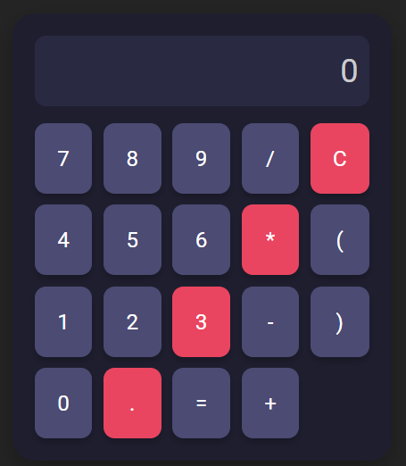

<!-- README.md -->

<h1 align="center">✨ Stylish Calculator ✨</h1>

<p align="center">
  
</p>

<p align="center">
  A sleek and animated calculator built with <strong>React</strong> and <strong>Vite</strong>, deployed seamlessly on <strong>Vercel</strong>. 🧮⚡
</p>

---

## 🚀 Live Demo
Explore the stylish calculator in action here:  
👉 [Stylish Calculator](https://calculator-iota-sepia.vercel.app/)

---

## 🎨 Features
- **Elegant Design**: A modern, eye-catching UI.  
- **Smooth Animations**: Every button press and result display is brought to life with fluid animations.  
- **Responsive**: Works flawlessly across devices and screen sizes.  
- **Powerful Calculations**: Perform basic arithmetic with precision and ease.  

---

## 🛠️ Built With
- **React**: A JavaScript library for building user interfaces.  
- **Vite**: A lightning-fast frontend build tool.  
- **CSS Animations**: Enhancing the user experience with transitions and effects.

---

## 📦 Getting Started

### Prerequisites
Make sure you have the following installed on your machine:
- [Node.js](https://nodejs.org/)
- [Vite](https://vitejs.dev/)

### Installation
1. **Clone the Repository**:
   ```bash
   git clone https://github.com/your-username/stylish-calculator.git
   cd stylish-calculator
